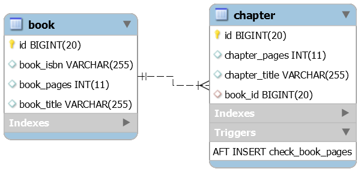

How To Implement Complex Data Integrity Constraints And Rules

Description: Consider the Book and Chapter entities. A book has a maximum accepted number of pages (book_pages) and the author should not exceed this number. When a chapter is ready for review, the author is submitting it. At this point, the publisher should check that the currently total number of pages doesn't exceed the allowed book_pages:

This kind of checks or constraints are easy to implement via database triggers. This application relies on a MySQL trigger to empower our complex contraint (check_book_pages).

Key points:

define a MySQL trigger that run after each insert (if you want to run it after each update as well then extract the trigger logic into a function and call it from two triggers - this is specific to MySQL, while is PostgreSQL we have AFTER INSERT OR AFTER UPDATE)