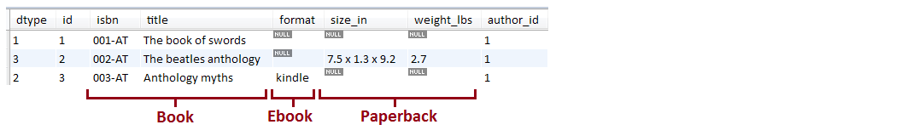

JPA Inheritance - SINGLE_TABLE

Description: This application is a sample of using JPA Single Table inheritance strategy (SINGLE_TABLE).

Key points:

this is the default inheritance strategy (@Inheritance(strategy=InheritanceType.SINGLE_TABLE))
all the classes in an inheritance hierarchy are represented via a single table in the database
subclasses attributes non-nullability is ensured via @NotNull and MySQL triggers
the default discriminator column memory footprint was optimized by declaring it of type TINYINT
Output example (below is a single table obtained from 3 entities):

