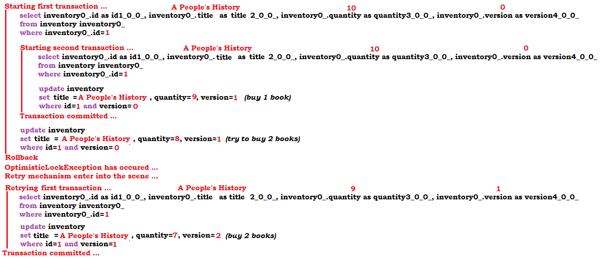

How To Retry Transactions After OptimisticLockException Exception (@Version)

Note: Optimistic locking mechanism via @Version works for detached entities as well.

Description: This is a Spring Boot application that simulates a scenario that leads to an optimistic locking exception. When such exception occur, the application retry the corresponding transaction via db-util library developed by Vlad Mihalcea.

Key points:

for Maven, in pom.xml, add the db-util dependency
configure the OptimisticConcurrencyControlAspect bean
mark the method (not annotated with @Transactional) that is prone to throw (or that calls a method that is prone to throw (this method can be annotated with @Transactional)) an optimistic locking exception with @Retry(times = 10, on = OptimisticLockingFailureException.class)
